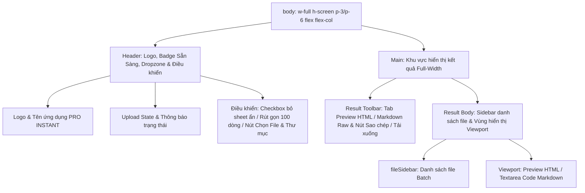

# Cấu trúc và Luồng hoạt động: Web Tĩnh Native Client-Side Engine

Tài liệu này mô tả chi tiết cấu trúc phân cấp giao diện (UI Tree), các trạng thái (Application States), luồng nghiệp vụ xử lý dữ liệu và hướng dẫn bảo trì/nâng cấp hệ thống.

## 1. Cấu trúc Giao diện (UI Tree)



---

## 2. Quản lý Trạng thái Ứng dụng (Application States)

| Tên trạng thái | Kiểu dữ liệu | Phạm vi | Mô tả chi tiết |
| :--- | :--- | :--- | :--- |
| `currentResults` | `Array<Object>` | Toàn cục | Mảng chứa danh sách kết quả sau khi chuyển đổi: `[{ filename, markdown, markdown_preview, images, has_images }]`. |
| `currentActiveIndex` | `number` | Toàn cục | Chỉ số của tệp tin đang được chọn hiển thị trong danh sách batch. |
| `chkExcludeHidden.checked` | `boolean` | Giao diện | Tùy chọn bỏ qua các sheet ẩn trong workbook Excel (.xlsx/.xlsm). |
| `chkLimitRows.checked` | `boolean` | Giao diện | Tùy chọn rút gọn xem trước 100 dòng đầu đối với các bảng tính Excel lớn. |

---

## 3. Luồng Nghiệp vụ Chuyển Đổi (Sequence Diagram)

```mermaid
sequenceDiagram
    participant User as Người dùng
    participant UI as Giao diện Web (index.html)
    participant CoreEngine as Native Client Engine (JS)
    participant JSZip as Thư viện JSZip (Client)

    User->>UI: Kéo thả file / thư mục vào Dropzone
    UI->>UI: Đọc file vào RAM (ArrayBuffer)
    UI->>UI: Hiển thị trạng thái "Đang xử lý..."
    
    rect rgb(20, 25, 45)
        Note over UI, CoreEngine: Xử lý 100% bằng JavaScript Engine trên máy khách
        loop Cho từng file trong danh sách
            UI->>CoreEngine: convertDocumentNative(buffer, filename, excludeHidden)
            alt File Excel (.xlsx/.xlsm)
                CoreEngine->>CoreEngine: ExcelJS: Đọc công thức, theme colors, ô gộp, trích xuất ảnh
            else File PowerPoint (.pptx)
                CoreEngine->>CoreEngine: JSZip + DOM: Trích xuất slide text, bảng, toàn bộ ảnh media
            else File Word (.docx)
                CoreEngine->>CoreEngine: Mammoth.js: Chuyển đổi HTML/Markdown & ảnh
            else File PDF (.pdf)
                CoreEngine->>CoreEngine: PDF.js: Trích xuất văn bản từng trang
            end
            CoreEngine-->>UI: Trả về kết quả { markdown, markdown_preview, images, has_images }
        end
    end

    UI->>UI: Cập nhật giao diện Preview HTML / Markdown Raw
    UI->>UI: Mở khóa nút Sao chép & Tải xuống
    
    opt Người dùng bấm "Tải xuống"
        User->>UI: Bấm nút Tải xuống / Tải tất cả (ZIP)
        UI->>JSZip: Tạo gói .zip chứa file .md và ảnh nhúng
        JSZip-->>UI: Sinh Blob URL
        UI-->>User: Tải trực tiếp về máy tính tức thì (0% Server Load)
    end
```



---

## 4. Các Sự kiện chính (Main Events)

- **`dropzone.drop` / `fileInput.change` / `folderInput.change`**: Thu thập danh sách `File`, đọc nội dung qua `file.arrayBuffer()` và kích hoạt hàm `processFiles()`.
- **`chkLimitRows.change`**: Kích hoạt `renderActiveDocument()` để đổi ngay giữa bản preview 100 dòng và bản full mà không cần convert lại file.
- **`btnPreview.click` / `btnCode.click`**: Đổi tab hiển thị giữa Rendered HTML và Raw Markdown.
- **`btnCopy.click`**: Sao chép nội dung `codeArea.value` vào Clipboard hệ thống với hiệu ứng phản hồi trực quan.
- **`btnDownload.click`**: Tạo file `.md` đơn lẻ hoặc gói nén `.zip` hoàn chỉnh thông qua `JSZip`.

---

## 5. Hướng dẫn Bảo trì & Nâng cấp (Maintenance & Extension Guide)

### 5.1. Thêm hỗ trợ định dạng file mới
1. Mở file `index.html` (hoặc `pro/index.html`).
2. Tìm đến hàm `convertDocumentNative(buffer, filename, excludeHidden)`:
   ```javascript
   else if (lower.endsWith('.new_ext')) {
       res = await convertNewExtension(buffer, filename);
   }
   ```
3. Định nghĩa hàm `convertNewExtension(buffer, filename)` trả về cấu trúc chuẩn:
   ```javascript
   return {
       markdown: "Nội dung Markdown đầy đủ",
       markdown_preview: "Nội dung Markdown rút gọn",
       images: { "image_name.png": { base64: "...", mime: "...", data_uri: "..." } },
       has_images: true // hoặc false
   };
   ```

### 5.2. Tùy biến Style bảng Excel
Các quy tắc CSS của bảng Excel nằm trong biến `styleBlock` của hàm `convertExcel()`:
- `.excel-table-wrap`: Khung chứa cuộn ngang.
- `.excel-table`: Thuộc tính bảng chính.
- `.excel-table th`: Tiêu đề cột A, B, C...
- `.excel-table .row-idx`: Cột số thứ tự hàng 1, 2, 3...
