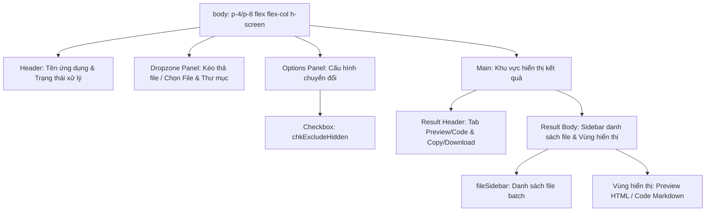

# Cấu trúc và Luồng hoạt động: static/index.html

Tài liệu này mô tả cấu trúc phân cấp giao diện (UI Tree), các trạng thái (States) và luồng nghiệp vụ xử lý dữ liệu của trang chính.

## 1. Cấu trúc Giao diện (UI Tree)

## 2. Quản lý Trạng thái (Application States)

| Tên trạng thái | Kiểu dữ liệu | Mô tả |
| :--- | :--- | :--- |
| `currentMarkdown` | `string` | Nội dung Markdown hiện tại đang hiển thị trong vùng xem chi tiết. |
| `currentResults` | `array` | Danh sách kết quả trả về từ API Batch (dành cho chế độ chuyển đổi nhiều file). |
| `currentJobId` | `string` | UUID định danh công việc (Job ID) hiện tại để hỗ trợ truy xuất ảnh hoặc kiểm tra status. |
| `excludeHiddenSheets` | `boolean` | Trạng thái checkbox `chkExcludeHidden` quyết định có lọc bỏ các sheet ẩn của Excel hay không. |

## 3. Luồng Nghiệp vụ (Logic & Event Flow)

### 3.1. Luồng tải lên và chuyển đổi (Upload & Process Flow)

```mermaid
sequenceDiagram
    participant User as Người dùng
    participant UI as Giao diện Web
    participant API as FastAPI Server
    participant Worker as Subprocess Worker

    User->>UI: Kéo thả / Chọn file (Excel/Word/PPTX...)
    Note over UI: Đọc trạng thái #chkExcludeHidden.checked
    UI->>API: POST /api/convert hoặc /api/convert_batch?exclude_hidden_sheets=...
    API->>UI: Phản hồi nhanh: { job_id, status: 'processing' }
    UI->>UI: Hiển thị trạng thái "Đang xử lý..." (Spinner & Badge)
    
    rect rgb(20, 20, 30)
        Note over API, Worker: Chạy ngầm trong Thread & Subprocess
        API->>Worker: python worker.py <job_id> <job_dir> <file_path> <filename> [--exclude-hidden-sheets]
        Worker->>Worker: Đọc Excel, tạo bản preview (giới hạn 100 dòng) và bản full
        Worker-->>API: Ghi file kết quả md/zip & success.txt / error.txt
    end
    
    loop Kiểm tra Trạng thái (Polling mỗi 2 giây)
        UI->>API: GET /api/status/{job_id}
        API-->>UI: Trả về trạng thái hiện tại (completed / processing / error), ưu tiên trả về nội dung preview
    end
    
    UI->>UI: Tắt màn hình chờ, hiển thị kết quả (Markdown/HTML Preview)
    UI->>User: Kích hoạt nút Copy và Download
```

## 4. Các Sự kiện chính (Main Events)

- **`chkExcludeHidden.change`**: Lưu giữ cấu hình tùy chọn để áp dụng khi người dùng bắt đầu tải file tiếp theo.
- **`dropzone.drop` / `fileInput.change` / `folderInput.change`**: Kích hoạt hàm `handleFiles` để thu thập danh sách file, chuẩn bị `FormData` và bắt đầu tiến trình gửi lên API.
- **`btnPreview.click` / `btnCode.click`**: Thay đổi tab hiển thị giữa giao diện render HTML thân thiện và mã nguồn Markdown thô.
- **`btnCopy.click`**: Sao chép nội dung Markdown thô hiện tại vào Clipboard.
